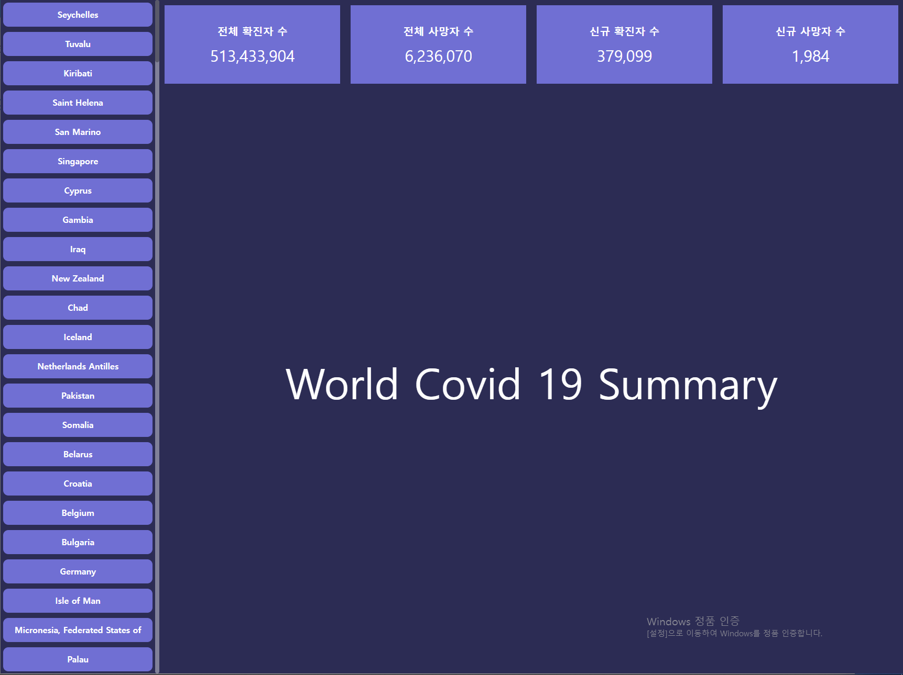
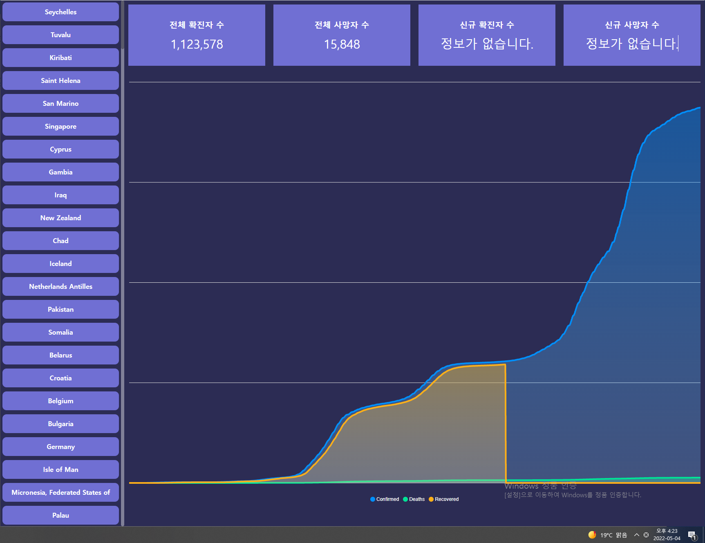

# 월드 코로나 현황판

[페이지 바로이동](https://yongjin-jo.github.io/world-covid-19/)

## 사용한 라이브러리

- apexcharts
  - react-apexcharts
- react-redux
  - @reduxjs/toolkit
- styled-components

## 주요 기능

### 확진자, 사망자, 확진자 수 표시

페이지 접속시 상황 판에 전세계 코로나 확진자 수 표시

### 차트 기능 구현

사이드 바 국가 클릭시 해당 코로나 상황 차트 생성

## 기타 기능

- 사이드 바에 국가 표시
